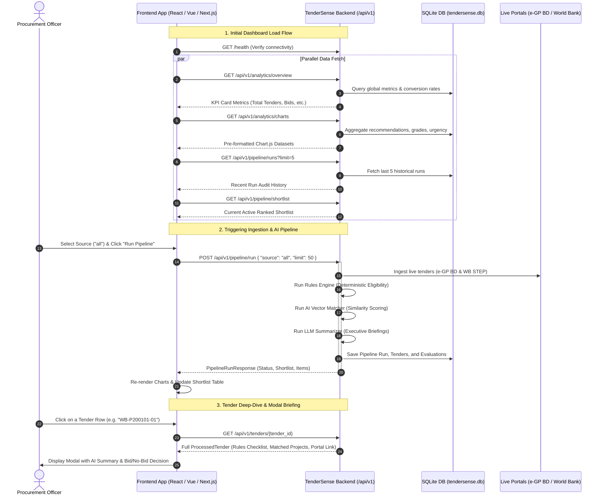

# TenderSense Frontend Integration & API Guide

This document provides complete technical specifications, architectural flows, TypeScript interfaces, and endpoint payloads for the frontend engineering team.

---

## 1. System Architecture & Workflow



---

## 2. Global Server Configuration

- **Local Base URL**: `http://localhost:8000`
- **Cloud / Staging Base URL**: `https://<your-service>.onrender.com`
- **API Version Prefix**: `/api/v1`
- **Interactive Swagger UI**: `http://localhost:8000/docs`
- **OpenAPI Schema (JSON)**: `http://localhost:8000/openapi.json`
- **Built-in HTML Dashboard**: `http://localhost:8000/dashboard`
- **CORS**: Fully open (`*`) for cross-origin local and cloud frontend development.
- **Headers**:
  ```http
  Content-Type: application/json
  Accept: application/json
  ```

---

## 3. TypeScript Interfaces (`types.ts`)

You can save this directly into your frontend codebase at `src/types/tendersense.ts`:

```typescript
export type MatchGrade = 'S' | 'A' | 'B' | 'C';
export type Recommendation = 'BID' | 'HOLD' | 'SKIP';
export type UrgencyLevel = 'CRITICAL' | 'URGENT' | 'NORMAL' | 'EXPIRED';
export type PipelineSource = 'all' | 'egp_bd' | 'world_bank' | 'test_dataset';

export interface RuleCheckDetail {
  rule_name: string;
  passed: boolean;
  required_value: any;
  company_value: any;
  message: string;
}

export interface EligibilityEvaluation {
  is_eligible: boolean;
  failure_reasons: string[];
  passed_rules: string[];
  checks: RuleCheckDetail[];
}

export interface MatchedProject {
  project_id: string;
  name: string;
  client: string;
  domain: string;
  relevance_score: number;
}

export interface SemanticMatchResult {
  similarity_score: number;
  matched_services: string[];
  top_matching_projects: MatchedProject[];
  domain_alignment: 'High' | 'Medium' | 'Low';
  explanation?: string;
}

export interface NormalizedTender {
  tender_id: string;
  source_portal: string;
  title: string;
  description: string;
  category?: string;
  procurement_type?: string;
  procurement_method?: string;
  estimated_value?: number;
  currency: string;
  required_turnover?: number;
  required_certifications: string[];
  allowed_geographies: string[];
  publication_date?: string;
  closing_date?: string;
  days_until_deadline: number;
  urgency_flag: UrgencyLevel;
  issuing_entity?: string;
  country_code?: string;
  country_name?: string;
  source_url?: string;
}

export interface ProcessedTender {
  tender_id: string;
  title: string;
  source_portal: string;
  match_grade: MatchGrade;
  recommendation: Recommendation;
  ai_summary: string;
  days_until_deadline: number;
  closing_date?: string;
  urgency_flag: UrgencyLevel;
  is_eligible: boolean;
  eligibility_evaluation: EligibilityEvaluation;
  semantic_result: SemanticMatchResult;
  tender: NormalizedTender;
  processing_time_ms: number;
}

export interface DailyShortlist {
  generated_at: string;
  total_evaluated: number;
  eligible_count: number;
  ineligible_count: number;
  bid_count: number;
  hold_count: number;
  skip_count: number;
  grade_s_count: number;
  grade_a_count: number;
  grade_b_count: number;
  grade_c_count: number;
  tenders: ProcessedTender[];
}

export interface PipelineRunRequest {
  source?: PipelineSource;
  limit?: number;
  save_to_shortlist?: boolean;
}

export interface PipelineRunResponse {
  status: string;
  total_processed: number;
  duration_seconds: number;
  shortlist: DailyShortlist;
}

export interface AnalyticsOverview {
  total_tenders_monitored: number;
  total_pipeline_runs: number;
  active_portals_count: number;
  total_evaluations: number;
  recommended_bids: number;
  opportunities_on_hold: number;
  skipped_tenders: number;
  grade_s_elite_matches: number;
  grade_a_strong_matches: number;
  average_semantic_score: number;
  bid_conversion_rate_pct: number;
}

export interface ChartDataset {
  labels: string[];
  data: number[];
  colors?: string[];
}

export interface ChartDataResponse {
  recommendation_donut: ChartDataset;
  grade_bar: ChartDataset;
  portal_distribution: ChartDataset;
  urgency_breakdown: ChartDataset;
  runs_timeline: {
    labels: string[];
    total_evaluated: number[];
    bids_identified: number[];
  };
}

export interface PipelineRunSummary {
  run_id: string;
  source: string;
  total_evaluated: number;
  bid_count: number;
  hold_count: number;
  skip_count: number;
  grade_s_count: number;
  grade_a_count: number;
  duration_seconds: number;
  created_at: string;
}

export interface CompanyService {
  service_id: string;
  name: string;
  description: string;
  keywords: string[];
}

export interface PastProject {
  project_id: string;
  name: string;
  client: string;
  client_type: string;
  description: string;
  domain: string;
  technologies: string[];
  value_bdt: number;
  value_usd: number;
  completion_year: number;
  duration_months: number;
}

export interface Certification {
  name: string;
  standard_code: string;
  issuing_body: string;
  valid_until: string;
  status: string;
}

export interface BracITProfile {
  company_name: string;
  tagline: string;
  country_of_incorporation: string;
  operating_regions: string[];
  annual_turnover_bdt: number;
  annual_turnover_usd: number;
  years_in_business: number;
  total_staff: number;
  services: CompanyService[];
  past_projects: PastProject[];
  certifications: Certification[];
}
```

---

## 4. API Endpoints Catalog

### Group A: Health & Diagnostic

#### `GET /health`
- **Description**: Verifies service status and active AI model providers.
- **Response `200 OK`**:
  ```json
  {
    "status": "healthy",
    "environment": "development",
    "embedding_provider": "huggingface",
    "llm_provider": "groq"
  }
  ```

---

### Group B: Analytics & Visualizations

#### `GET /api/v1/analytics/overview`
- **Description**: High-level procurement KPIs for top stat cards.
- **Frontend Target**: Header stats / Hero KPI counters.
- **Response `200 OK`**:
  ```json
  {
    "total_tenders_monitored": 17,
    "total_pipeline_runs": 6,
    "active_portals_count": 2,
    "total_evaluations": 38,
    "recommended_bids": 14,
    "opportunities_on_hold": 12,
    "skipped_tenders": 12,
    "grade_s_elite_matches": 6,
    "grade_a_strong_matches": 8,
    "average_semantic_score": 0.684,
    "bid_conversion_rate_pct": 36.8
  }
  ```

#### `GET /api/v1/analytics/charts`
- **Description**: Pre-formatted datasets tailored directly for Chart.js, Recharts, or ApexCharts.
- **Frontend Target**: Dashboard analytics widgets.
- **Response `200 OK`**:
  ```json
  {
    "recommendation_donut": {
      "labels": ["BID (High Priority)", "HOLD (Evaluate)", "SKIP (Ineligible/Low Match)"],
      "data": [14, 12, 12],
      "colors": ["#10B981", "#F59E0B", "#EF4444"]
    },
    "grade_bar": {
      "labels": ["Grade S (Elite)", "Grade A (Strong)", "Grade B (Moderate)", "Grade C (Low)"],
      "data": [6, 8, 10, 14],
      "colors": ["#8B5CF6", "#3B82F6", "#06B6D4", "#64748B"]
    },
    "portal_distribution": {
      "labels": ["e-GP Bangladesh", "World Bank STEP"],
      "data": [9, 8],
      "colors": ["#0284C7", "#059669"]
    },
    "urgency_breakdown": {
      "labels": ["Critical (<=3d)", "Urgent (<=7d)", "Normal (>7d)", "Expired"],
      "data": [3, 5, 8, 1],
      "colors": ["#EF4444", "#F97316", "#10B981", "#94A3B8"]
    },
    "runs_timeline": {
      "labels": ["16:45:12", "17:02:40", "17:40:11"],
      "total_evaluated": [10, 20, 20],
      "bids_identified": [3, 7, 6]
    }
  }
  ```

---

### Group C: Pipeline Execution & Shortlist

#### `POST /api/v1/pipeline/run`
- **Description**: Triggers live ingestion from e-GP Bangladesh & World Bank STEP, applies the rules filter, computes semantic vector matching, generates AI summaries, and ranks the shortlist.
- **Frontend Target**: "Run Pipeline" execution modal.
- **Request Body**:
  ```json
  {
    "source": "all",
    "limit": 50,
    "save_to_shortlist": true
  }
  ```
  *(Parameters: `source`: `"all"` | `"egp_bd"` | `"world_bank"` | `"test_dataset"`. `limit`: integer, defaults to `50`.)*

- **Response `200 OK`**:
  ```json
  {
    "status": "completed",
    "total_processed": 20,
    "duration_seconds": 1.452,
    "shortlist": {
      "generated_at": "2026-09-10T17:44:11.890",
      "total_evaluated": 20,
      "eligible_count": 14,
      "ineligible_count": 6,
      "bid_count": 6,
      "hold_count": 5,
      "skip_count": 9,
      "grade_s_count": 3,
      "grade_a_count": 3,
      "grade_b_count": 5,
      "grade_c_count": 9,
      "tenders": [
        {
          "tender_id": "WB-P200101-01",
          "title": "National Digital Health Registry and Interoperability Platform",
          "source_portal": "World Bank STEP",
          "match_grade": "S",
          "recommendation": "BID",
          "ai_summary": "High-priority match for BracIT's enterprise software services. 100% rule-compliant.",
          "days_until_deadline": 18,
          "closing_date": "28-Sep-2026",
          "urgency_flag": "NORMAL",
          "is_eligible": true,
          "eligibility_evaluation": {
            "is_eligible": true,
            "failure_reasons": [],
            "passed_rules": ["TurnoverCheck", "CertCheck", "GeoCheck", "DeadlineCheck"],
            "checks": [
              {
                "rule_name": "TurnoverCheck",
                "passed": true,
                "required_value": 2500000.0,
                "company_value": 5416667.0,
                "message": "Company USD turnover ($5.42M) exceeds required $2.50M."
              }
            ]
          },
          "semantic_result": {
            "similarity_score": 0.842,
            "domain_alignment": "High",
            "matched_services": ["Enterprise Software Development", "Health Tech"],
            "top_matching_projects": [
              {
                "project_id": "PRJ-004",
                "name": "DGHS Electronic Medical Record System",
                "client": "Directorate General of Health Services",
                "domain": "Health Tech",
                "relevance_score": 0.884
              }
            ]
          },
          "tender": {
            "tender_id": "WB-P200101-01",
            "source_portal": "World Bank STEP",
            "title": "National Digital Health Registry and Interoperability Platform",
            "description": "Consulting services to design and deploy national health registry.",
            "estimated_value": 2500000.0,
            "currency": "USD",
            "source_url": "https://projects.worldbank.org/en/projects-operations/procurement-detail/WB-P200101-01",
            "urgency_flag": "NORMAL",
            "days_until_deadline": 18
          },
          "processing_time_ms": 78.4
        }
      ]
    }
  }
  ```

#### `GET /api/v1/pipeline/shortlist`
- **Description**: Loads the cached daily shortlist instantly without re-running ingestion.
- **Query Parameters**:
  - `force_refresh` (boolean, optional, default: `false`)
- **Response `200 OK`**: Returns `DailyShortlist` object.

#### `GET /api/v1/pipeline/shortlist/export`
- **Description**: Downloadable formatted summary.
- **Query Parameters**:
  - `format`: `"markdown"` or `"table"` (default: `"markdown"`)
- **Response `200 OK`**: `text/plain` formatted export.

---

### Group D: Tenders & Search

#### `GET /api/v1/tenders`
- **Description**: Queries processed tenders with multi-parameter filtering.
- **Query Parameters**:
  - `grade`: `S` | `A` | `B` | `C`
  - `recommendation`: `BID` | `HOLD` | `SKIP`
  - `is_eligible`: `true` | `false`
  - `urgency`: `CRITICAL` | `URGENT` | `NORMAL` | `EXPIRED`
  - `search`: string (matches title or description text)
  - `limit`: integer (1 to 200, default: `50`)
- **Example Call**: `/api/v1/tenders?grade=S&recommendation=BID&limit=10`
- **Response `200 OK`**: `ProcessedTender[]`

#### `GET /api/v1/tenders/{tender_id}`
- **Description**: Detailed inspection for a single tender (opens modal view).
- **Example Call**: `/api/v1/tenders/WB-P200101-01`
- **Response `200 OK`**: Single `ProcessedTender` object.
- **Error `404 Not Found`**:
  ```json
  { "detail": "Tender with ID 'XYZ' not found." }
  ```

---

### Group E: Historical Run Audit

#### `GET /api/v1/pipeline/runs`
- **Description**: Returns recent pipeline executions stored in SQLite.
- **Query Parameters**:
  - `limit`: integer (default: `10`, max: `50`)
- **Response `200 OK`**:
  ```json
  [
    {
      "run_id": "a9d70104-51e8-46ba-b844-325b7b998fe1",
      "source": "all",
      "total_evaluated": 20,
      "bid_count": 6,
      "hold_count": 5,
      "skip_count": 9,
      "grade_s_count": 3,
      "grade_a_count": 3,
      "duration_seconds": 1.452,
      "created_at": "2026-09-10T17:44:11.890000"
    }
  ]
  ```

#### `GET /api/v1/pipeline/runs/{run_id}`
- **Description**: Detailed tenders and scores from a past execution.
- **Response `200 OK`**:
  ```json
  {
    "run_id": "a9d70104-51e8-46ba-b844-325b7b998fe1",
    "total_items": 20,
    "items": [
      {
        "tender_id": "WB-P200101-01",
        "title": "National Digital Health Registry",
        "source_portal": "World Bank STEP",
        "source_url": "https://projects.worldbank.org/...",
        "closing_date": "28-Sep-2026",
        "days_until_deadline": 18,
        "urgency_flag": "NORMAL",
        "is_eligible": true,
        "similarity_score": 0.842,
        "domain_alignment": "High",
        "match_grade": "S",
        "recommendation": "BID",
        "ai_summary": "High-priority match for BracIT.",
        "matched_services": ["Health Tech", "Cloud"],
        "processing_time_ms": 78.4
      }
    ]
  }
  ```

---

### Group F: BracIT Company Profile

#### `GET /api/v1/profile`
- **Description**: Returns active BracIT capabilities, certifications, revenue, and past projects.
- **Response `200 OK`**: Returns `BracITProfile` object.

#### `PUT /api/v1/profile`
- **Description**: Updates profile configuration (e.g. updating annual turnover or adding a new ISO certification).
- **Request Body**: Full `BracITProfile` JSON.
- **Response `200 OK`**: Returns updated `BracITProfile`.

---

## 5. UI Component Implementation Matrix

| UI Component | Backend Endpoint | Recommended Frontend Tooling |
| :--- | :--- | :--- |
| **Top KPI Metrics Bar** | `GET /api/v1/analytics/overview` | Tailwind CSS stat cards |
| **Recommendation Donut** | `GET /api/v1/analytics/charts` | Chart.js `doughnut` / Recharts `PieChart` |
| **Match Grade Bar Chart** | `GET /api/v1/analytics/charts` | Chart.js `bar` |
| **Urgency Badge Chart** | `GET /api/v1/analytics/charts` | Chart.js `polarArea` / horizontal bar |
| **Shortlist Table** | `GET /api/v1/tenders` or `GET /api/v1/pipeline/shortlist` | TanStack Table / AG Grid |
| **"Run Pipeline" Button** | `POST /api/v1/pipeline/run` | Axios / TanStack Query `useMutation` |
| **Tender Modal Briefing** | `GET /api/v1/tenders/{id}` | Radix UI Dialog / Headless UI Modal |
| **Audit History Table** | `GET /api/v1/pipeline/runs` | Expandable accordion rows |
