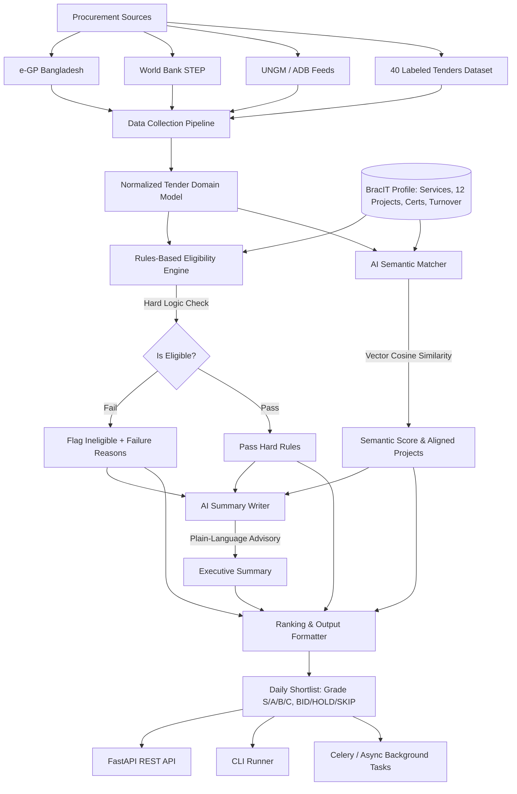

# TenderSense: Intelligent Procurement Monitoring & Decision Engine

**TenderSense** is a modern Python backend system built for **BracIT Services Limited**. The system watches procurement portals (such as Bangladesh e-GP and World Bank STEP), automatically matches tender notices against BracIT's capability profile, filters out ineligible opportunities using deterministic hard logic, and produces a ranked daily shortlist complete with match grades (**S, A, B, C**), plain-language executive summaries, and clear **BID / HOLD / SKIP** recommendations.

---

## Key Capabilities

1. **Automated Ingestion Pipeline**: Pulls and normalizes tender notices from Bangladesh e-GP, World Bank STEP, and future feeds (UNGM, ADB).
2. **BracIT Capability Profile**: Comprehensive schema including core services, 12 past enterprise projects, ISO/CMMI certifications, and annual turnover.
3. **AI Semantic Matcher**: Compares tender requirements and deliverables against BracIT's capabilities using conceptual vector cosine similarity, avoiding simple keyword search limitations.
4. **Hard-Logic Rules Engine**: Deterministic rules engine (zero AI) strictly evaluating turnover, required certifications, allowed geographies, and submission deadlines with multi-currency normalization.
5. **AI Summary Writer**: Generates plain-language executive rationales (via GPT-4o-mini, Claude Haiku, or deterministic heuristic fallback) detailing strengths and missing criteria. *Strictly decoupled from eligibility decisions.*
6. **Tiered Ranking & Formatting**: Assigns grades (S, A, B, C), recommendations (BID, HOLD, SKIP), urgency flags (CRITICAL, URGENT, NORMAL, EXPIRED), and outputs structured JSON, Markdown, or terminal tables.
7. **Ultra-Fast Performance Target**: Benchmarked at **~5-8 milliseconds per tender**, massively exceeding the **< 60 seconds per tender** requirement.

---

## System Architecture



---

## Core Modules

### 1. Data Collection Pipeline (`src/ingestion/`)
- `EGPBangladeshAdapter`: Parses exact e-GP Bangladesh JSON notices (`slNo`, `tenderId`, `refNo`, `status`, `nature`, `title`, `ministry`, `division`, `organization`, `method`, `publishingDate`, `closingDate`, etc.).
- `WorldBankStepAdapter`: Parses exact World Bank STEP notices (`bid_description`, `country_code`, `deadline_date`, `id`, `project_id`, `sector`, `url`, etc.).
- `UNGMPortalAdapter` & `ADBPortalAdapter`: Extensible interface stubs ready for UN and Asian Development Bank feeds.
- `TestDatasetLoader`: Ingests and validates the bundled benchmark dataset of 40 labeled tenders (`data/test_tenders_40.json`).

### 2. Data Modeling & State Management (`src/models/`, `data/`)
- `BracITProfile`: Company capability profile featuring:
  - 7 Core technical service offerings (Custom Software, Cloud & DevOps, Data & AI, ERP/MIS, Cybersecurity, e-Governance, Mobile Platforms).
  - 12 Completed past projects with government ministries, multilateral agencies, banks, and NGOs (BRAC, DGFP, a2i, UNHCR, Aarong, Bangladesh Bank, DAE, DDM, DSHE, PKSF, EBL, CPTU).
  - ISO 9001, ISO 27001, ISO 20000, and CMMI-DEV Level 3 certifications.
  - Annual Turnover: 650 Million BDT (~ $5.42M USD).
- `NormalizedTender`: Domain model bridging different portal formats into unified properties with deadline calculations.

### 3. AI Semantic Matcher (`src/matcher/`)
- Compares each tender against BracIT's specific past project deliverables and practice areas.
- Vector semantic comparison detects conceptual synergy (e.g. matching "eLMIS Medical Supplies" to "National Health Logistics System", or "Citizen Single Sign-On" to "e-Government Service Bus").
- Pluggable providers: OpenAI (`text-embedding-3-small`), local SentenceTransformers, or high-performance local vector semantics.

### 4. Rules-Based Eligibility Checker (`src/rules/`)
- Deterministic hard logic with zero hallucination risk:
  - **Turnover Rule**: Rejects tenders if required annual turnover > BracIT capacity, with multi-currency conversion (BDT, USD, EUR).
  - **Certification Rule**: Rejects tenders demanding missing credentials (e.g. ISO 14001, CMMI Level 5).
  - **Geography Rule**: Rejects tenders restricted to non-operating countries.
  - **Deadline Rule**: Rejects expired submissions.
  - **Procurement Nature Boundary**: Flags pure physical commodities (e.g. diesel generators, furniture, asphalt, bridges).
- Returns explicit human-readable failure explanations.

### 5. AI Summary Writer (`src/summarizer/`)
- Generates 2-3 sentence executive briefing explaining:
  - Why the tender matched (specific past projects and service alignments).
  - What requirements might be missing or risks to address (e.g. tight deadline, local partner needed).
- **Strict Isolation Guarantee**: AI outputs are strictly advisory and NEVER override the hard pass/fail eligibility outcome.

### 6. Ranking & Output Formatting (`src/ranking/`)
- **Grade S**: Top-tier match (Score >= 0.82, 100% rule eligible, strong past project match) -> **Recommendation: BID**
- **Grade A**: Solid match (Score >= 0.68, 100% rule eligible) -> **Recommendation: BID**
- **Grade B**: Moderate / Conditional fit (Score >= 0.50 or critical tight deadline) -> **Recommendation: HOLD**
- **Grade C**: Low similarity or Ineligible (Failed hard rules or score < 0.50) -> **Recommendation: SKIP**
- **Urgency Flags**:
  - `CRITICAL` (<= 3 days remaining)
  - `URGENT` (<= 7 days remaining)
  - `NORMAL` (> 7 days remaining)
  - `EXPIRED` (<= 0 days)

---

## Quickstart Guide

### 1. Environment Setup
```bash
# Clone and enter workspace
cd /home/sajibbarua/myProject/Model_Mavericks_TenderSense

# Activate virtual environment
source .venv/bin/activate

# Install dependencies (if not already installed)
pip install -r requirements.txt
```

### 2. Run CLI Pipeline
```bash
# Display BracIT Company Profile
python cli.py profile

# Process the 40 benchmark tenders and output formatted Table
python cli.py run --source test_dataset --format table

# Export ranked shortlist as GitHub-flavored Markdown
python cli.py run --source test_dataset --format markdown

# Export full structured JSON
python cli.py run --source test_dataset --format json
```

### 3. Launch the FastAPI Server
```bash
# Start server with Uvicorn
uvicorn src.main:app --host 0.0.0.0 --port 8000 --reload
```
Interactive Swagger API documentation is available at:
`http://localhost:8000/docs`

---

## REST API Endpoints

| Method | Path | Description |
|---|---|---|
| `GET` | `/health` | Health status and provider configuration |
| `GET` | `/api/v1/profile` | View active BracIT capability profile |
| `PUT` | `/api/v1/profile` | Update BracIT capability profile |
| `POST` | `/api/v1/pipeline/run` | Trigger on-demand ingestion and ranking |
| `GET` | `/api/v1/pipeline/shortlist` | Get current active daily shortlist |
| `GET` | `/api/v1/pipeline/shortlist/export` | Export shortlist in Markdown or Table format |
| `GET` | `/api/v1/tenders` | Query processed tenders with filters (`grade`, `recommendation`, `urgency`, `search`) |
| `GET` | `/api/v1/tenders/{tender_id}` | Detailed inspection of single tender, rules breakdown, and AI summary |

---

## Running the Automated Test Suite

Run all unit and integration tests covering all 6 core modules:
```bash
pytest -v
```

Test coverage includes:
- `tests/test_models.py`: Exact e-GP and World Bank JSON parsing, BracIT profile validation.
- `tests/test_ingestion.py`: Ingestion adapters, benchmark dataset loading, pipeline extensibility.
- `tests/test_rules_engine.py`: Turnover conversion, missing certs, geography rules, expired deadlines.
- `tests/test_semantic_matcher.py`: Vector semantic similarity vs keyword matching.
- `tests/test_summarizer.py`: Plain-language generation and strict rule isolation.
- `tests/test_ranking.py`: S/A/B/C grades, BID/HOLD/SKIP recommendations, urgency flags.
- `tests/test_orchestrator.py`: End-to-end execution and performance target verification (< 60s per tender).
- `tests/test_api.py`: FastAPI HTTP endpoint tests.
# ThreadSync
